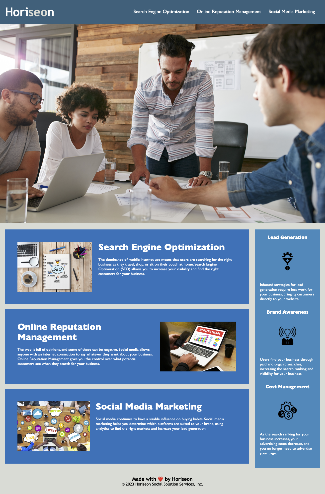

# Accessible Marketing Agency Codebase

## Description

I updated this codebase to optimize the webpage for search engines by improving adherence to accessibility standards with the goal of ensuring the site can be accessed with assistive technologies. By updating the HTML code to include semantic elements, I was able to eliminate confusion about the function of each webpage element. I also created alt elements for each image, so that a description of each image is built into the webpage.

In completing this project, I learned how to analyze existing code for bugs and implement accessibility features into the code.

## Installation
N/A

## Usage

Each section of the webpage includes information about services offered by Horiseon Marketing Agency, including Search Engine Optimization, Online Reputation Management, and Social Media Marketing. Each section can be naviagted to directly by selecting the option from the navigation bar at the top of the page. Additionally, the user can find information about the benefits of these services in the aside on the right side of the webpage.

## Credits

The starter code for this project can be found here: 
https://github.com/coding-boot-camp/urban-octo-telegram

## License

MIT License
